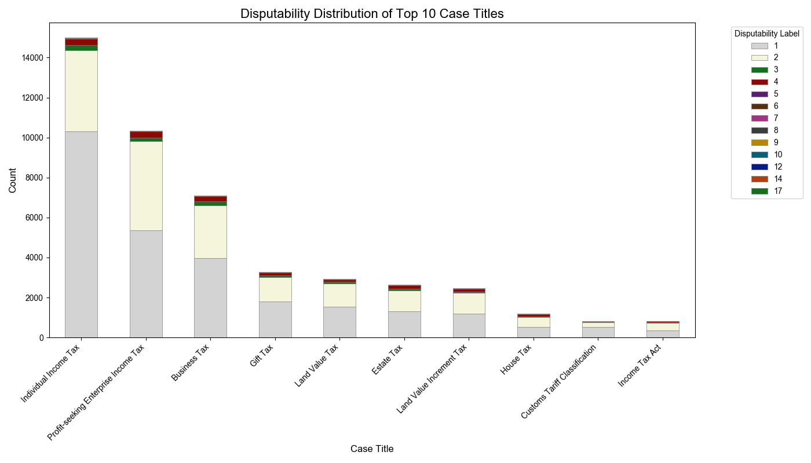
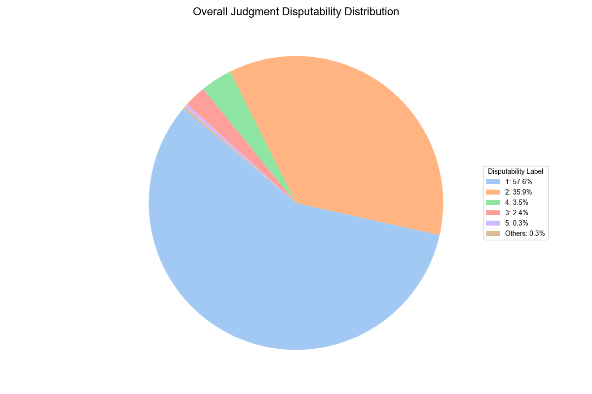
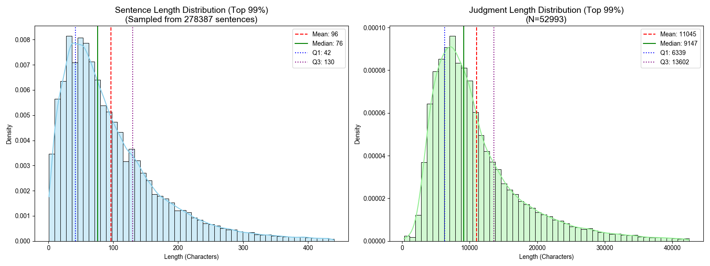

# Disputability Datasets for Taiwanese Administrative Tax Cases (DDTAT)

## Overview
This dataset contains over 50,000 administrative litigation judgments from Taiwan, primarily focusing on tax law cases. It provides a rich resource for legal natural language processing (LegalNLP), specifically for tasks such as disputability detection, legal judgment prediction, and document structure analysis.

The dataset is hosted on Hugging Face Hub: [hochienH/DDTAT](https://huggingface.co/datasets/hochienH/DDTAT)

The dataset is organized into two configurations:
1.  **judgements**: Full text and metadata for each judgment.
2.  **sentences**: Over 4.5 million sentences annotated with disputability labels.

## Dataset Structure

### 1. Judgements (Config: `judgements`)
*   **Content**: Full text and metadata of judgments.
*   **Fields**:
    *   `JID`: Unique Judgment ID (e.g., `KSBA,102,訴,424,20150325,3`)
    *   `JYEAR`: Case Year
    *   `JCASE`: Case Type (e.g., 訴, 簡)
    *   `JNO`: Case Number
    *   `JDATE`: Judgment Date
    *   `JTITLE`: Case Reason/Title (e.g., 綜合所得稅)
    *   `JFULL`: Full text of the judgment
    *   `DISPUTABILITY`: Document-level label

### 2. Sentences (Config: `sentences`)
*   **Content**: Annotated sentences.
*   **Fields**:
    *   `檔名`: Corresponding Judgment ID
    *   `句子編號`: Sentence Sequence ID
    *   `句子內容`: Text content of the sentence
    *   `DISPUTABILITY`: Sentence-level label

## Usage

You can easily load the dataset using the Hugging Face `datasets` library.

```python
from datasets import load_dataset

# Load Sentences
ds_sentences = load_dataset("hochienH/DDTAT", "sentences")
print(ds_sentences['train'][0])

# Load Judgments
ds_judgements = load_dataset("hochienH/DDTAT", "judgements")
print(ds_judgements['train'][0])
```

## Statistics

### Data Volume
*   **Total Judgments**: 52,993
*   **Total Sentences**: 4,479,889

### Length Distribution (Characters)
| Level | Mean | Median | Std Dev | Q1 (25%) | Q3 (75%) |
|-------|------|--------|---------|----------|----------|
| **Sentence** | 101.09 | 76.00 | 92.36 | 42.00 | 132.00 |
| **Judgment** | 11,487.13 | 9,207.00 | 8,257.11 | N/A | N/A |

### Disputability Label Distribution
The dataset is imbalanced, with the majority of sentences falling into two categories (Label 1 and Label 2).

| Label | Count | Percentage |
|-------|-------|------------|
| **1** | 2,360,486 | 52.69% |
| **2** | 1,761,577 | 39.32% |
| **3** | 123,971 | 2.77% |
| **4** | 199,589 | 4.46% |
| **5** | 20,359 | 0.45% |
| **Others** | ~13,000 | < 0.3% |

### Top 10 Case Titles (Reasons)
The dataset is heavily focused on tax administration.
1.  **Individual Income Tax** (綜合所得稅)
2.  **Profit-seeking Enterprise Income Tax** (營利事業所得稅)
3.  **Business Tax** (營業稅)
4.  **Gift Tax** (贈與稅)
5.  **Land Value Tax** (地價稅)
6.  **Estate Tax** (遺產稅)
7.  **Land Value Increment Tax** (土地增值稅)
8.  **House Tax** (房屋稅)
9.  **Customs Tariff Classification** (進口貨物核定稅則號別)
10. **Income Tax Act** (所得稅法)

## Visualizations

### 1. Disputability Distribution by Case Title

*Distribution of disputability labels across the top 10 most frequent case types. Labels 1 and 2 are highlighted in lighter colors.*

### 2. Overall Judgment Disputability

*Overall proportion of disputability labels across the entire dataset.*

### 3. Length Statistics

*Distribution of sentence lengths and full judgment lengths (Top 99%).*


